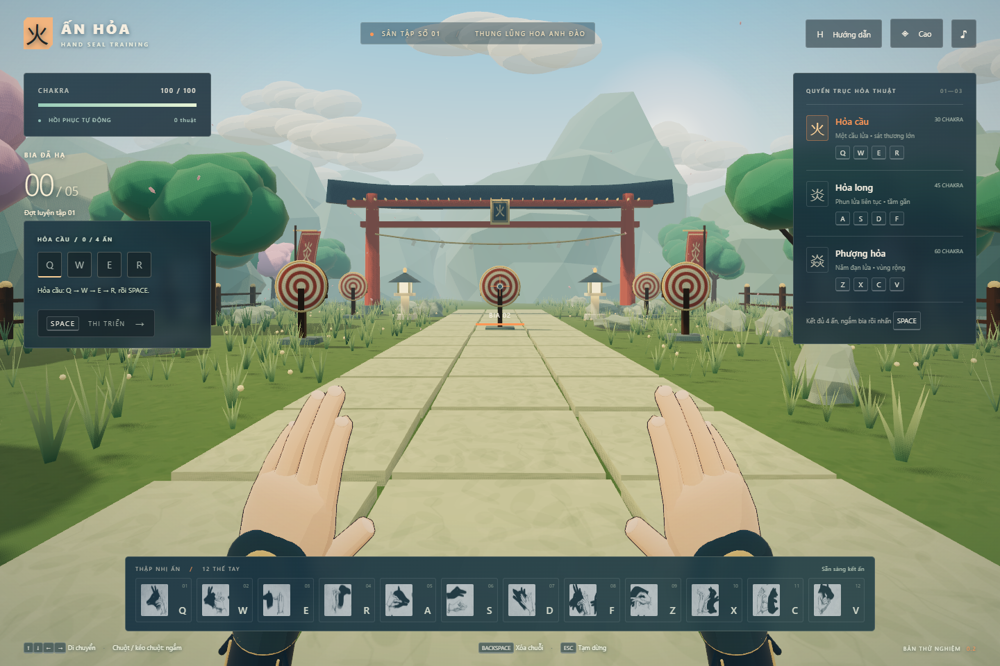

# Ấn Hỏa — Sân tập kết ấn anime 3D

Game góc nhìn thứ nhất lấy cảm hứng từ kết ấn ninja, với phong cách anime: toon shading, ánh sáng viền, bóng đổ mềm, sân tập cây hoa và ba hỏa thuật.

## Chơi ngay

Mở **index.html** bằng Chrome hoặc Edge hỗ trợ **WebGL 2**, bấm **Bắt đầu luyện tập** hoặc Enter. Bản game đã đóng gói sẵn; không cần Node.js, tải CDN hay Internet. Giữ index.html, style.css, game-core.js, game.js và ket_an.jpg trong cùng thư mục.

Nếu trình duyệt không khóa con trỏ khi mở tệp, giữ và kéo chuột để ngắm. Khi có Node.js, có thể chạy **npm start** và mở http://127.0.0.1:4173.

## Những thay đổi ở bản 0.2

- Bộ dựng Three.js, quản lý màu sRGB, tone mapping và hậu kỳ bloom.
- Model tay **GLB có skinning, 16 xương và 12 animation clip**, ngón bo tròn, móng, găng tay, tay áo và chi tiết màu vàng. Chuyển thế bằng quaternion và làm mượt từng khớp, có động tác thu tay khi thi triển và vòng chakra lúc đủ ấn.
- Vật liệu toon nhiều bậc sáng, ánh viền ấm và nét viền mảnh trên bàn tay.
- Đá và núi không đều, texture đá/gỗ/cỏ vẽ bằng mã, cổng mái cong, dây treo giấy, cờ vải, đèn đá, cây hoa, hoa nhỏ và các lớp núi có sương ở xa.
- Gió tác động tới cỏ, lá và cờ; cánh hoa rơi và mây chuyển động. Cỏ dùng instancing để giảm số lệnh vẽ.
- Ánh nắng có bóng đổ mềm, ánh trời và đèn đá. Hỏa thuật phát ánh sáng thật lên cảnh và tay.
- Lửa có lõi biến dạng, vỏ sáng, đuôi lửa, tia lửa, khói và vòng va chạm; camera rung nhẹ khi thi triển.
- Ba mức đồ họa **Cao / Cân bằng / Thấp**, điều chỉnh độ phân giải, chống răng cưa, mật độ cỏ, bóng đổ và bloom. Bấm nút ◈ trên thanh trên cùng để đổi mức.
- Tôn trọng cài đặt giảm chuyển động của hệ điều hành: giảm rung/bob camera và chuyển động giao diện.

Mô hình và môi trường là asset gốc được tạo từ nguồn trong repository. GLB có thể nhập vào Blender để chỉnh mesh, xương và animation; công cụ xuất asset ở đây dùng Three.js GLTFExporter. Phong cách hướng tới anime stylized, không phải bản sao asset hay mức chi tiết của Genshin Impact.

## 12 ấn và cách gán phím

Chọn **bốn hàng đầu của ket_an.jpg**, đọc từ trái sang phải và từ trên xuống dưới. Tên mô tả do game đặt để phân biệt ảnh; không phải tên ấn chính thức trong Naruto. Hình tham chiếu của từng ấn nằm ở bảng dưới màn hình.

| Phím | Vị trí trong ảnh | Mô tả |
| --- | --- | --- |
| Q | Hàng 1, cột 1 | Mỏ nhọn |
| W | Hàng 1, cột 2 | Tai kép |
| E | Hàng 1, cột 3 | Trụ thẳng |
| R | Hàng 2, cột 1 | Móc tay |
| A | Hàng 2, cột 2 | Chụm ngang |
| S | Hàng 2, cột 3 | Song chỉ |
| D | Hàng 3, cột 1 | Xòe chéo |
| F | Hàng 3, cột 2 | Khóa ngón |
| Z | Hàng 3, cột 3 | Vòng cung |
| X | Hàng 4, cột 1 | Chắp nghiêng |
| C | Hàng 4, cột 2 | Mở lòng |
| V | Hàng 4, cột 3 | Cuộn tay |

Các thế tay được diễn giải cho rig của game; chưa sử dụng giải va chạm vật lý giữa các ngón.

## Hỏa thuật

| Thuật | Chuỗi phím, bấm lần lượt | Thi triển | Chakra | Hiệu ứng |
| --- | --- | --- | --- | --- |
| Hỏa cầu | Q → W → E → R | Space | 30 | Một cầu lửa, 70 sát thương |
| Hỏa long | A → S → D → F | Space | 45 | Phun lửa 1,5 giây, tầm khoảng 10 m; mỗi đạn 18 sát thương |
| Phượng hỏa | Z → X → C → V | Space | 60 | Năm đạn lửa xòe ngang, mỗi đạn 35 sát thương |

Bấm từng phím theo thứ tự, không giữ đồng thời. Game tự nhận cả ba chuỗi; không bắt buộc chọn thuật trước. Chuỗi chiêu là thiết kế cho bản game này.

- Chakra tối đa 100, hồi 9 mỗi giây. Chờ 1,2 giây giữa hai thuật.
- Bấm sai sẽ xóa chuỗi; nếu phím đó mở đầu một thuật khác thì bắt đầu chuỗi mới từ phím ấy.
- Sau 7 giây không nhập ấn, chuỗi hết hạn. Thiếu chakra vẫn giữ chuỗi để chờ hồi trong giới hạn này.
- Hướng bắn theo tâm ngắm. Mỗi đợt có 5 bia, mỗi bia 100 máu. Hạ hết để sang lượt mới.

## Điều khiển

- **Q W E R A S D F Z X C V:** kết ấn; cũng có thể bấm nút ấn trên giao diện.
- **Space:** thi triển. **Backspace:** xóa chuỗi.
- **Mũi tên:** di chuyển. **Shift + mũi tên:** đi nhanh.
- **Chuột:** ngắm khi đã khóa con trỏ; **giữ và kéo chuột** nếu không khóa được.
- **1 / 2 / 3:** xem công thức thuật. **H:** ẩn/hiện quyển trục. **M:** bật/tắt âm thanh.
- **Esc:** tạm dừng và thả con trỏ. **Enter:** bắt đầu, tiếp tục hoặc sang lượt mới.
- Chuyển khỏi cửa sổ/tab tự tạm dừng. Bắt đầu lại lượt tập khôi phục chakra, bia, điểm và vị trí.

## Phát triển

Yêu cầu Node.js **20 trở lên**. Cài dependency bằng **npm ci**.

- **npm run assets:** tạo lại assets/ninja-hands.glb và module nhúng từ src/hand-model.js, cùng 12 clip từ src/poses.js.
- **npm run build:** bundle src/main.js thành game.js để chơi trực tiếp, ngoại tuyến.
- **npm start:** máy chủ cục bộ ở cổng 4173.
- **npm test:** kiểm thử luật, cấu trúc GLB và các đường dẫn máy chủ cục bộ.
- **npm run test:browser:** kiểm thử 12 thế tay, gameplay và các mức đồ họa trên Edge headless thật.
- **npm run test:graphics:** kiểm tra pixel đường đá khi chuyển mức đồ họa, các thế tay tiếp xúc và ảnh ở cửa sổ nhỏ.

Hai kiểm thử trình duyệt mặc định dùng Microsoft Edge tại đường dẫn cài đặt thông thường trên Windows; đặt **BROWSER_PATH** để dùng Chromium/Chrome ở đường dẫn khác. Test dùng render WebGL phần mềm SwiftShader; đây không phải benchmark FPS của GPU người chơi. Kết quả và ảnh kiểm thử nằm trong test-results, được gitignore.

Chỉ URL có tham số **test=1** mới bật bước thời gian xác định phục vụ kiểm thử. Chế độ chơi thông thường chạy theo requestAnimationFrame.

## Cấu trúc mã

- src/main.js: điều khiển, HUD, camera, chất lượng đồ họa và tích hợp.
- src/scene.js: môi trường, ánh sáng, bóng đổ và gió.
- src/hand-model.js / src/hands.js / src/poses.js: tạo model, rig và chuyển thế.
- src/materials.js: toon shader, ánh viền, nét viền và texture procedural.
- src/effects.js: lửa, ánh sáng, tia lửa, khói và vòng va chạm.
- game-core.js: luật kết ấn, chakra và thời gian chờ.
- tools: xuất GLB, build và chụp ảnh trên trình duyệt.
- assets/ninja-hands.glb: model có thể chỉnh trong Blender. assets/hand-data.js: dữ liệu nhúng để chơi ngoại tuyến.

Giấy phép của Three.js nằm trong THIRD_PARTY_NOTICES.md.
